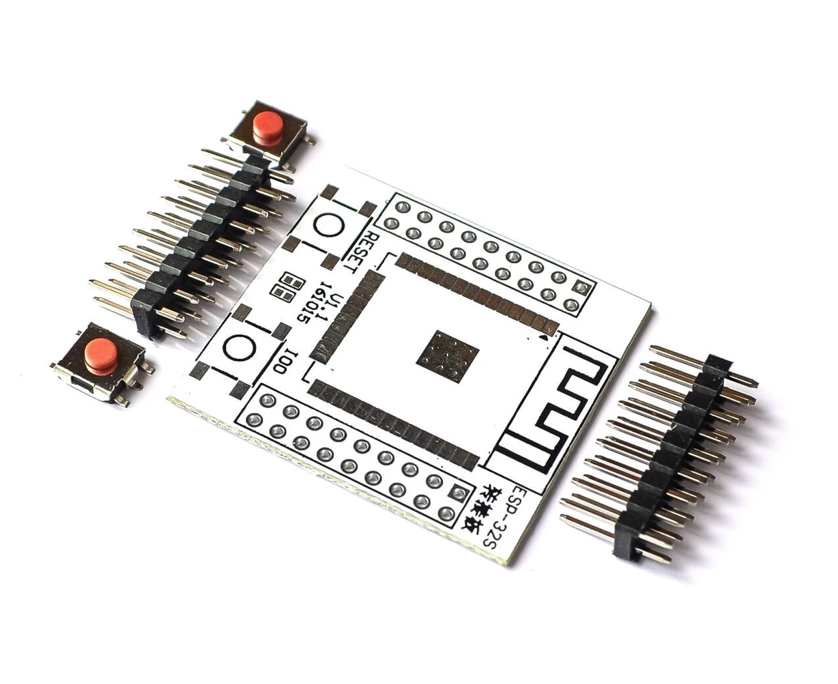
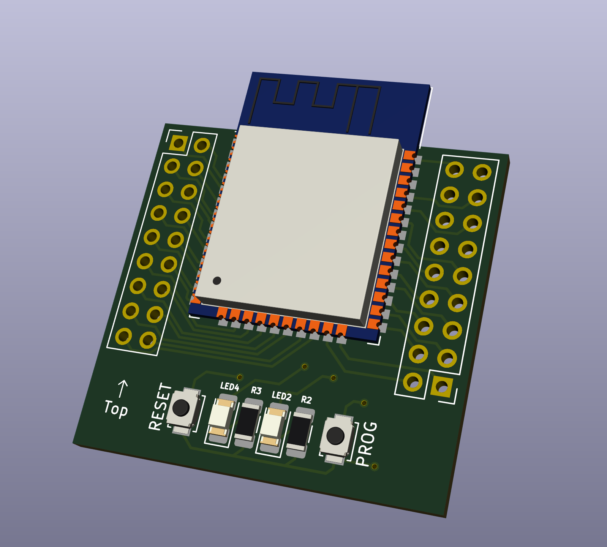
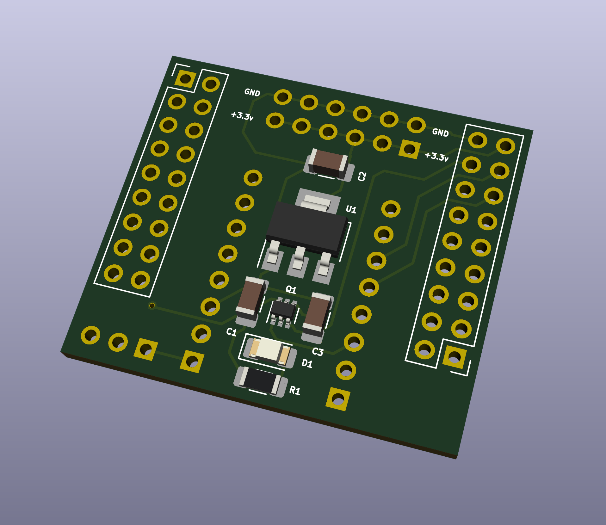

This repository contains [Kicad5](https://www.kicad.org) and other files for building modular boards for ESP32 applications.

I often find that typical development boards for the ESP32 (such as the popular [Espressif ESP32 DevkitC](https://www.espressif.com/en/products/devkits/esp32-devkitc)) are great for development purposes, but sometimes less than optimal for deployment in the field.  Not only are they more expensive than they need to be, but they also contain components, such as a micro USB adapter, UART logic, and 5v voltage regulators that are not needed for 3.3v deployments (e.g., when powered off a 3.3v LiFePo4 battery) and may even detract from the power efficiency of the application.

The Kicad designs in this repository are intended to rectify some of these shortcomings, by separating the application logic from the ESP32 board itself, but in a modular way, so that you can, for example, design specific applications for your ESP32 device into which you can "plug in" your ESP32 module.  This repository also contains an adapter board for flashing the ESP32, keeping all of the micro-USB, UART, and 5v power regulation on a separate board.

The Kicad sketches in these files is designed to be pin-compatible with the common and cheap ESP32 adapter boards, which you can find on many of the on-line electronics distributors:

If you have some of these adapter boards already, you should be able to plug these modules into your design.

The sketches in this repository are designed around a board of approximate dimensions of 30.344mm x 34.620mm.  All of the boards contain two sets of 2x9 2.54mm junctions, which can be used for male pins or female headers, depending on your application.  The spacing between the center of the inner rows of these junctions is 2.54mm (1in), to be compatible with the ESP32 adapter board mentioned above.  In addition, the pin assignments for ESP32 GPIO pins is also identical to the above board.

> Note that this board is _NOT_ breadboard-friendly.

The following sketches are included in this repository.

# `esp32-wroom-shield`

The [esp32-wroom-shield](esp32-wroom-shield) sketch contains a similar design as the above adapter board, but with a few added components.

The components on this board include:

* Pads for the ESP32 WROOM module;
* Two sets of 2x9 2.54mm junctions, which can be used for pins or headers (at your discretion).  These junctions are PIN compatible with the ESP32 adapter board mentioned above.
* Two capacitors between VCC and GND;
* Pull-up resistor on EN;
* Push-button switches and capacitors for EN (`RESET`) and IO0 (`PROG`);
* Two (optional) status LEDs and resistors attached to IO2 and IO4.

This board is intended to contain a minimal set of functionality for deployment into an application.  The board may be deployed with dupont wires to connect peripherals, as needed, or may be integrated with a pin-compatible board of your own design (See the [`template`](#template) below).  All 37 GPIO pins on the ESP32 are exposed via this board.  (The one extra junction pin is mapped to GND.)

# `adafruit-cp2104-friend-adapter`

The [adafruit-cp2104-friend-adapter](adafruit-cp2104-friend-adapter) sketch contains an adapter board for integration with the [Adafruit CP2104 Friend](https://www.adafruit.com/product/3309).  This sketch can be used to connect to your ESP32 via the CP2104 USB-UART adapter onboard the Adafruit CP2104 Friend board to flash an application onto your ESP32, or for other development purposes.  The [Adafruit CP2104 Friend](https://www.adafruit.com/product/3309) can be purchased directly from Adafruit or from many parts suppliers.

This board includes:

* Two sets of 2x9 2.54mm junctions, which can be used for pins or headers (at your discretion).  These junctions are PIN compatible with the ESP32 adapter board mentioned above.
* Two sets of 1x8 2.54mm junctions, for integration with the the [Adafruit CP2104 Friend](https://www.adafruit.com/product/3309);
* AMS1117 voltage regulator and capacitors, for 3.3v power supply to the ESP32;
* A pair of SS8050-G transistors and resistors to provide auto-boot and flash;
* A capacitor on EN to delay restart on the UART control signal;
* A power status LED connected to +5v.

# `template`

The [template](template) sketch is a template for designing your own boards for integration with the [esp32-wroom-shield](esp32-wroom-shield).

This board includes:

* Two sets of 2x9 2.54mm junctions, which can be used for pins or headers (at your discretion).  These junctions are PIN compatible with the ESP32 adapter board mentioned above.

Use this board to get started with your own design!
